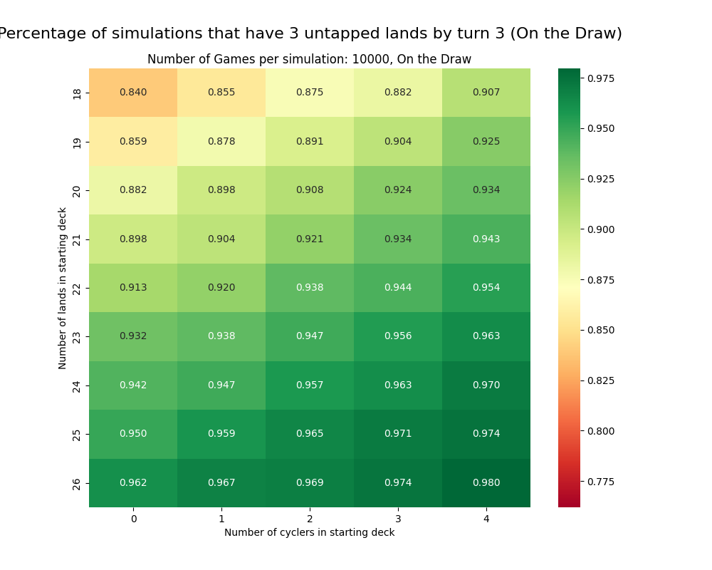

# **Temur Rhinos Monte Carlo Simulation**

## Overview

This project aims to simulate a game of the "Temur Rhinos" Magic: The Gathering (MTG) deck archetype and analyze the probability of having a certain number of lands in play by turn 3. The simulation takes into account the number of lands and cyclers in the starting deck and runs multiple game simulations to gather statistical data. The probability analysis is performed through heatmaps, which visually represent the results.

## Dependencies

* [Just](https://github.com/casey/just)
* Python 3 (version 3.11.4 recommended)

## Setup

To install all dependencies, run the following command:

```
just setup
```

## Commands

* `just rhinos`: Run the `temur_rhinos.py` script and save the output to a CSV file.
* `just graph`: Generate a heatmap for the CSV file generated by `just rhinos`.
* `just graph-rhinos`: Combines `just rhinos` and `just graph` into one command.

## Simulation Parameters

In the `temur_rhinos.py` script, you can customize the following parameters for the simulation:

```python
# Number of cyclers and lands to try in the simulation
N_CYCLERS_TO_TRY = [0, 1, 2, 3, 4]
N_LANDS_TO_TRY = [26, 25, 24, 23, 22, 21, 20, 19, 18]

# Number of games to simulate
N_GAMES = 10000

# Number of turns to simulate (e.g., turn 3)
N_TURNS = 3

# Play or draw (True for on the play, False for on the draw)
ON_THE_PLAY = True
```

You can adjust these parameters according to your needs to explore different scenarios.

## How it Works

1. The `temur_rhinos.py` script simulates a game by creating a deck based on the specified number of cyclers and lands.
2. The simulation runs for the specified number of games (e.g., 10,000) and records the game state after each turn (up to turn 3).
3. The simulation logs are saved to a CSV file named `game_log.csv`.

## Example Heatmaps

Below are example heatmaps generated by the `just graph-rhinos` command.

### Heatmap On the Draw



### Heatmap On the Play


These heatmaps visually represent the probabilities of having a certain number of lands in play by turn 3, considering various combinations of starting deck composition.

Feel free to explore different deck compositions and simulation parameters to analyze the impact on the game outcomes.

## License

This project is licensed under the MIT License - see the [LICENSE](LICENSE) file for details.

---
